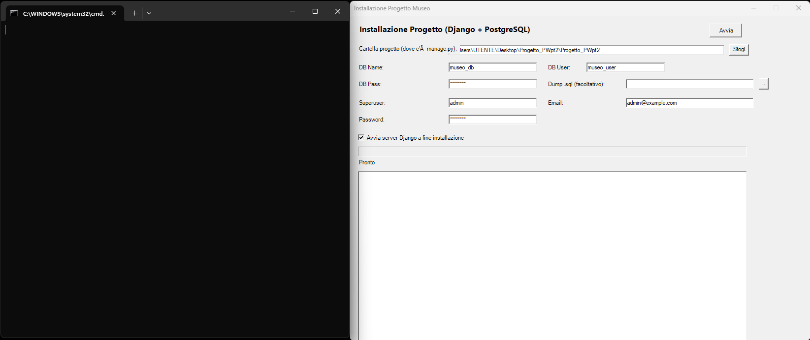
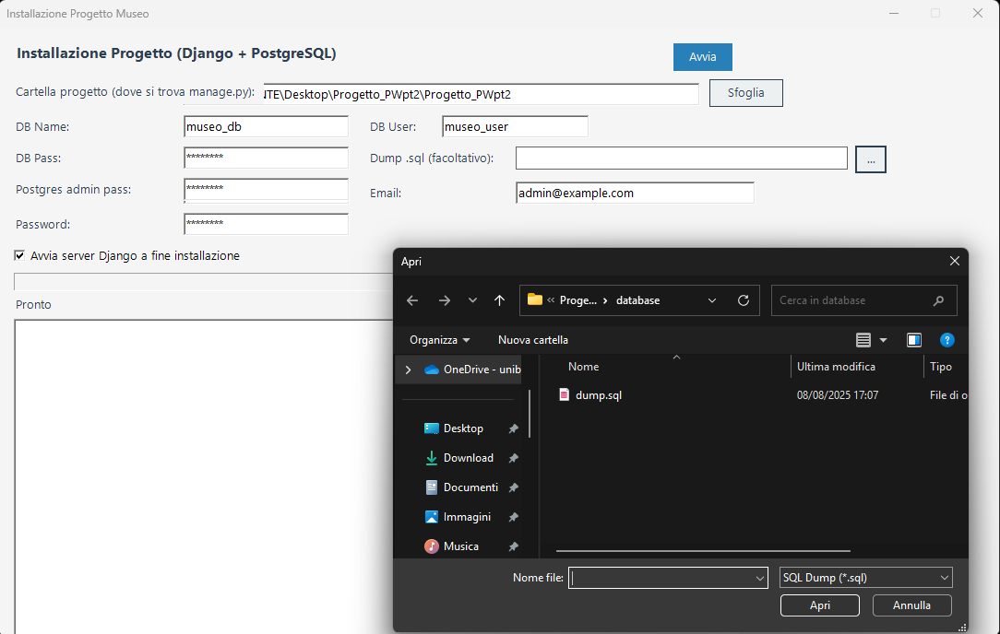
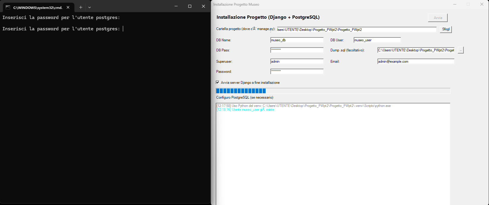

# Museo - Progetto PW25 (Django + Bootstrap)

## Requisiti
- **Python 3.10+**
- **PostgreSQL** (già installato)
- Tutto il resto viene installato automaticamente dallo script (`requirements.txt`)

---

## Installazione (Windows)

1. **Estrarre il progetto** in una cartella oppure clonarlo da github
2. **Aprire la cartella** ed entrare in `scripts`
3. **Fare doppio click** su `start_setup.bat`
4. Si aprono:
   - un **wizard grafico di installazione**  
   - una **finestra di comando (shell)**



5. Nel wizard:
   - usare **Sfoglia** per selezionare la **cartella principale del progetto** (quella con `manage.py`)  
   - usare **...** per selezionare il file `dump.sql` che si trova nella cartella datbase
   - lasciare invariati gli altri campi



6. **Cliccare Avvia**
7. Dopo pochi secondi compare la scritta **“configuro PostgreSQL”**  
   - nella shell viene richiesta la **password PostgreSQL**, quella scelta al momento dell'istallazione di Postgre (non appare mentre si scrive, ma viene letta)  
   - inserire la password due volte



8. Dopo l’inserimento della password il wizard **prosegue automaticamente**
9. Al termine:
   - il sito si apre automaticamente nel browser  
   - se non si apre, nel wizard compare un **link cliccabile** per accedere al sito  
   - attendere alcuni secondi per l’avvio del server Django

---

## Problemi comuni

1. **Python non trovato**  
   - verificare che il comando `py` funzioni da terminale  
   - se non funziona, aggiungere Python al **PATH di sistema**

2. **PostgreSQL non trovato**  
   - verificare che il comando `psql` funzioni da terminale  
   - se non funziona, aggiungere PostgreSQL al **PATH di sistema**

---

## Cambio Database

- **SQLite (default)**  
  - lasciare `DB_URL` **commentata** in `.env`

- **PostgreSQL**  
  - togliere il `#` davanti a `DB_URL`  
  - inserire le credenziali di accesso

---

## Backup installazione sicuro (riga di comando)

Se l’installazione tramite wizard e shell non funziona, è possibile usare una procedura alternativa da **riga di comando**.  
È più lunga e manuale, ma garantisce sempre il corretto funzionamento.  

Tutti i comandi da eseguire (uno per volta, nell’ordine) sono contenuti nel file `start.txt` nella cartella `scripts`.  
Di seguito la spiegazione di ciascun comando:

---

1. **Posizionarsi nella cartella del progetto**  
   ```powershell
   cd "PERCORSO\cartella\del\progetto"
   ```
   Porta la console dentro la cartella principale del progetto (quella dove si trova `manage.py`).

---

2. **Creare un ambiente virtuale Python**  
   ```powershell
   py -m venv .venv
   ```
   Crea una cartella `.venv` che contiene un ambiente isolato di Python.  
   Serve per installare le dipendenze del progetto senza toccare quelle globali del PC.

---

3. **Abilitare l’esecuzione di script PowerShell (se richiesto)**  
   ```powershell
   Set-ExecutionPolicy -Scope CurrentUser -ExecutionPolicy RemoteSigned
   ```
   Alcuni PC non permettono di eseguire script `.ps1`.  
   Con questo comando si concede il permesso.  
   Dopo averlo eseguito, **chiudere e riaprire PowerShell**, poi ripetere dal punto 1.

---

4. **Attivare l’ambiente virtuale**  
   ```powershell
   .\.venv\Scripts\Activate.ps1
   ```
   Attiva l’ambiente Python locale. Da questo momento, tutti i pacchetti installati finiscono dentro `.venv`.

---

5. **Aggiornare `pip`**  
   ```powershell
   pip install --upgrade pip
   ```
   Porta `pip` (il gestore pacchetti di Python) all’ultima versione, evitando errori di compatibilità.

---

6. **Installare le dipendenze del progetto**  
   ```powershell
   pip install -r requirements.txt
   ```
   Installa tutte le librerie necessarie (Django, Bootstrap, Pillow, ecc.).

---

7. **Creare un utente PostgreSQL per il progetto**  
   ```powershell
   psql -U postgres -c "CREATE USER museo_user WITH PASSWORD 'museo_pw';"
   ```
   Crea un nuovo utente chiamato `museo_user` con password `museo_pw`.

---

8. **Abilitare i permessi di creazione database all’utente**  
   ```powershell
   psql -U postgres -c "ALTER USER museo_user CREATEDB;"
   ```
   Concede a `museo_user` il permesso di creare database.

---

9. **Creare il database del progetto**  
   ```powershell
   psql -U postgres -c "CREATE DATABASE museo_db OWNER museo_user;"
   ```
   Crea un database chiamato `museo_db` e lo assegna come proprietario a `museo_user`.

---

10. **Caricare il dump iniziale dei dati**  
    ```powershell
    psql -U museo_user -d museo_db -f "PERCORSO_COMPLETO\dump.sql"
    ```
    Importa i dati dal file `dump.sql` dentro il database `museo_db`.  
    ⚠️ Sostituire `PERCORSO_COMPLETO` con il percorso reale del file.

---

11. **Applicare le migrazioni Django**  
    ```powershell
    py manage.py migrate
    ```
    Crea tutte le tabelle necessarie al funzionamento del progetto (gestite direttamente da Django).

---

12. **Creare un superuser Django**  
    ```powershell
    py manage.py createsuperuser
    ```
    Crea un utente amministratore per accedere al **pannello admin di Django**.  
    Verranno richiesti username, email e password.

---

13. **Avviare il server Django**  
    ```powershell
    py manage.py runserver
    ```
    Avvia il sito in locale. Per default è disponibile su [http://127.0.0.1:8000](http://127.0.0.1:8000).

---

14. **Aprire il sito nel browser**  
    Dopo l’avvio, copiare e incollare nel browser l’indirizzo mostrato (di solito `http://127.0.0.1:8000`), oppure ctrl+click il link.  

---

Con questa procedura manuale il progetto viene installato e avviato senza passare dal wizard grafico.


